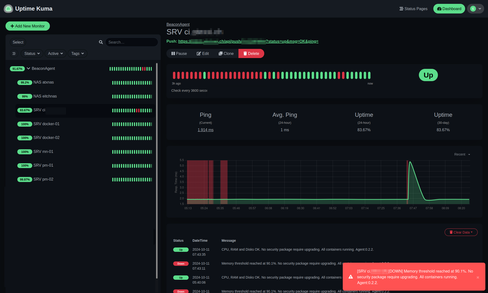

# Beacon Agent

This agent is used to monitor the state of a system and send periodic updates, or updates on thresholds reached to a remote server which in turn then will notify a user so they can take action.

Beacon Agent currently implements pushing the status to a [UptimeKuma](https://uptime.kuma.pet/) server, which can then send push notifications to a user using for example [Gotify](https://gotify.net/).

The Beacon Agent currently has the following features:
- Read basic system info like CPU load, Memory and Disk usage
- Check for any required security packages requiring upgrading
- Read S.M.A.R.T. values of SATA, SCSCI and NVME disks
- Validate disks are consecutive, i.e. no disk fails completely during system runtime
- On Docker hosts: Validate all docker containers currently known are in state running
- On Proxmox hosts: Validate all virtual machines and LX containers are in state running

## Example

 

# Requirements
The agent is written in Python and is known to work on Python 3.8. The agent has been tested on the following servers:
- Proxmox 7.x
- Ubuntu 22.04
- Synology NAS DSM 7.2.x

# Configuration
Configure your `config.json`, by updating the relevant fields:

    {
      "agent": {
        "api_type": "UptimeKuma",
        "api_url": "https://status.example.ch/api/push",
        "api_key": "your_api_key_here",
        "refresh_interval_seconds": 10,
        "notify_delay_minutes": 10,
        "notify_threshold_percent": 90
      },
      "system_metrics": {},
      "smartctl": {
        "enabled": true
      },
      "docker": {
        "enabled": true
      },
      "proxmox": {
        "enabled": true,
        "token_id": "",
        "token_secret": ""
      }
    }

Currently `api_type` can be one of `UptimeKuma` or `Simulated`.

To disable a reader, simply delete the section in the config file, or set `enabled` to `false`.

After modifying the file, restart the systemd service:

    sudo systemctl restart beacon-agent.service

# Installation

## Debian systems
Build debian package:

    ./build-deb.sh

Copy the package to your server and install the package:

    sudo apt install python3-requests python3-psutil
    sudo dpkg -i dist/beacon-agent-0.1.0.deb

Update your configuration, as described below, then restart the service:

    sudo systemctl restart beacon-agent.service

### Uninstall
To uninstall the agent, use the following command:

    sudo dpkg --remove beacon-agent

## Non-Debian systems, using systemd
Build tarball:

    ./build-dist.sh

Copy the package to your server and then extract it:

    tar -xvzf beacon-agent-0.1.0.tar.gz

Move/copy the `beacon-agent` directory to an appropriate place, e.g. `/usr/local/lib`

    sudo mv beacon-agent /usr/local/lib/
    cd /usr/local/lib/beacon-agent

Copy the example config and update it for your system:

    cp example_config.json config.json

Install the systemd service:

    sudo /usr/local/lib/beacon-agent/install_systemd.sh
    sudo journalctl --follow --unit beacon-agent.service

### Upgrade
Copy the package to your server and then extract it:

    tar -xvzf beacon-agent-0.2.0.tar.gz

And use rsync to copy the files, excluding any config file:

    sudo systemctl stop beacon-agent.service
    sudo rsync -avr --exclude='*config.json' beacon-agent/ /usr/local/lib/beacon-agent
    sudo /usr/local/lib/beacon-agent/install_systemd.sh
    sudo systemctl status beacon-agent.service
    sudo journalctl --follow --unit beacon-agent.service

And now remove the temporary files, which were extracted:

    rm -rf beacon-agent*

### Uninstall
To remove the agent, use the following commands:

    sudo systemctl stop beacon-agent.service
    sudo rm /etc/systemd/system/beacon-agent.service
    sudo rm -rf /usr/local/lib/beacon-agent
